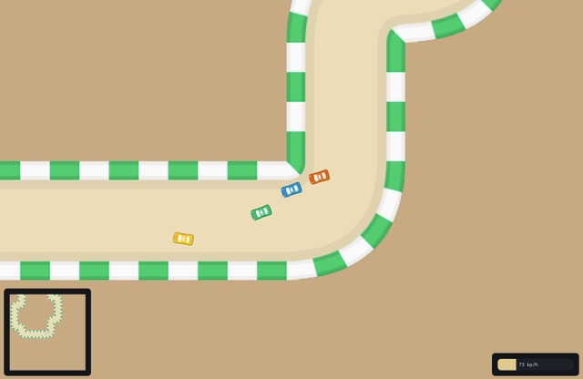
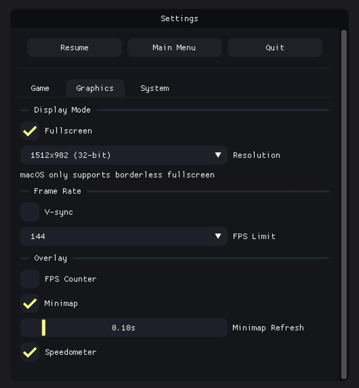

# vroom

[](https://github.com/ryouze/vroom/actions/workflows/ci.yml)
[](https://github.com/ryouze/vroom/actions/workflows/release.yml)


vroom is a cross-platform 2D racing game with arcade drift physics, procedurally-generated tracks, and waypoint AI.





## Motivation

I wanted to build a 2D racing game from scratch, without relying on existing game engines like Godot or Unity. To achieve this, I chose to build my own game engine in C++, allowing me to improve my understanding of C++ and game development.

The primary goal is to learn and explore, not to build a groundbreaking game. That said, I still want the final product to be enjoyable for non-developers; I am shipping a playable game, after all.


## Features

- Written in modern C++ (C++20).
- Highly optimized: runs at 90 FPS while drawing only 3 watts on the Steam Deck OLED.
- Procedurally generated tracks with user-defined parameters.
- Waypoint-based AI with real-time collision detection and distance-based throttle control.
- Analog input with support for both keyboard and gamepad (Xbox).
- Persistent settings/preferences: saved to disk as a TOML config file and automatically loaded at startup.
- Car engine, tire-squealing, and wall-hit sound effects, with fading and volume control.
- Comprehensive documentation with Doxygen-style comments.
- Automatic third-party dependency management using CMake's [FetchContent](https://www.foonathan.net/2022/06/cmake-fetchcontent/).
- No missing STL headers thanks to [header-warden](https://github.com/ryouze/header-warden).
- Single binary distribution with embedded assets thanks to [asset-packer](https://github.com/ryouze/asset-packer).


## To-Do

```md
**Ideas**
- Add `static_assert` checks throughout the codebase (e.g., `static_assert(isIntegral<int>() == true);`) to simplify debugging as the project scales.
  - Also implement compile-time enums and switch-case validation (I forgot why I wanted this?).
- Use `std::pair` for grouping related values to avoid creating separate variables or structs. Example: `Coordinate = std::pair<int, int>;`.
- Add `CarColor` enum, then set it in `Car` constructor, so the car is always aware what color it is.
  - This can be used in the `Leaderboard` UI widget and other places to avoid hardcoding the index-to-color mapping.

**Finishing Touches**
- Improve the packaging workflow:
  - Research the use of CPack for cross-platform distribution.
- Check all headers with `header-warden`.
- Add new screenshots of the main menu, settings, game, and a GIF (or video) of the game in action.
```


## Tested Systems

This project has been tested on the following systems:

- macOS 15.6 (Sequoia)
- Manjaro 24.0 (Wynsdey)
- Windows 11 23H2

Automated testing is also performed on the latest versions of macOS, GNU/Linux, and Windows using GitHub Actions.


## Pre-built Binaries

Pre-built binaries are available for macOS (ARM64), GNU/Linux (x86_64), and Windows (x86_64). You can download the latest version from the [Releases](../../releases) page.

To remove macOS quarantine, use the following commands:

```sh
xattr -d com.apple.quarantine vroom-macos-arm64.app
chmod +x vroom-macos-arm64.app
```

On Windows, the OS might complain about the binary being unsigned. You can bypass this by clicking on "More info" and then "Run anyway".


## Requirements

To build and run this project, you'll need:

- C++20 or higher
- CMake


## Build

Follow these steps to build the project:

1. **Clone the repository**:

    ```sh
    git clone https://github.com/ryouze/vroom.git
    ```

2. **Generate the build system**:

    ```sh
    cd vroom
    mkdir build && cd build
    cmake ..
    ```

    The default configuration (`cmake ..`) is recommended for most users and is also used by CI/CD to build the project.

    However, the build configuration can be customized using the following options:

    - `ENABLE_COMPILE_FLAGS` (default: ON) - Enables strict compiler warnings and treats warnings as errors. When ON, any code warnings will cause compilation to fail, ensuring clean code. When OFF, warnings are allowed and compilation continues. Disable if you encounter compilation issues due to warnings (although CI should catch such issues).
    - `ENABLE_STRIP` (default: ON) - Strips debug symbols from Release builds to reduce binary size. When ON, creates smaller executables but removes debugging information. When OFF, keeps full debugging symbols (useful for debugging crashes). Only affects Release builds.
    - `ENABLE_LTO` (default: ON) - Enables Link Time Optimization for Release builds, producing smaller and faster binaries. When ON, performs cross-module optimizations during linking. When OFF, skips LTO (faster compilation but larger/slower binary). Automatically disabled if compiler doesn't support LTO.
    - `ENABLE_CCACHE` (default: ON) - Optionally uses ccache to cache compilation results for faster rebuilds. When ON and ccache is installed, dramatically speeds up recompilation. When ON but ccache not installed, silently continues without ccache. When OFF, never uses ccache even if available.
    - `BUILD_TESTS` (default: OFF) - Builds unit tests alongside the main executable. When ON, creates test binaries that can be run with `ctest`. When OFF, skips test compilation for faster builds. See [Testing](#testing) for usage.

    Example command to disable strict compile flags and LTO:

    ```sh
    cmake .. -DENABLE_COMPILE_FLAGS=OFF -DENABLE_LTO=OFF
    ```

3. **Compile the project**:

    To compile the project, use the following command:

    ```sh
    cmake --build . --parallel
    ```

After successful compilation, you can run the program using `./vroom` (`open vroom.app` on macOS). However, it is highly recommended to install the program, so that it can be run from any directory. Refer to the [Install](#install) section below.

> [!TIP]
> The mode is set to `Release` by default. To build in `Debug` mode, use `cmake .. -DCMAKE_BUILD_TYPE=Debug`.


## Install

If not already built, follow the steps in the [Build](#build) section and ensure that you are in the `build` directory.

To install the program, use the following command:

```sh
sudo cmake --install .
```

On macOS, this will install the program to `/Applications`. You can then run `vroom.app` from the Launchpad, Spotlight, or by double-clicking the app in Finder.


## Usage

To start the program, simply run the `vroom` executable (`vroom.app` on macOS, `open /Applications/vroom.app` to run from the terminal).


### Controls

#### Keyboard

- **Gas**: Up Arrow (↑)
- **Brake**: Down Arrow (↓)
- **Left**: Left Arrow (←)
- **Right**: Right Arrow (→)
- **Handbrake**: Spacebar
- **Menu Options**: ESC

#### Gamepad (Xbox layout)

- **Gas/Brake**: Right Stick (↑↓)
- **Steering**: Left Stick (←→)
- **Handbrake**: A Button


### How the AI Works

The AI controls cars by following a sequence of waypoints placed along the track.

On every frame, each car (including the player) runs an `update()` function. For AI cars, it sets the AI inputs based on the car's position, velocity, and the direction of the next waypoint.

The AI checks the distance to the next waypoint to determine if it has been reached. Once a waypoint is reached, the AI advances to the next one, looping through the track. Waypoints are classified as `Straight` or `Corner` based on the procedurally generated track layout.

To steer, the AI compares the car's current heading to the direction of the next waypoint. If the misalignment exceeds a threshold, the AI turns left or right. When approaching corners, the AI turns earlier and more aggressively; on straight sections, it steers more smoothly.

The AI sets a target speed depending on whether the car is approaching a corner or traveling on a straight. If the current speed exceeds the target, the AI decelerates; if it is below the target, it accelerates. If the speed is close to the target, the AI coasts, relying on drag.

To avoid collisions, the AI scans ahead for potential wall impacts. If a crash is likely, it applies the handbrake and increases steering. The current, somewhat conservative values seem to prevent the AI from crashing into walls completely, but feedback is welcome.

To prevent AI cars from behaving identically, each instance uses its own random number generator. This introduces small variations in reaction distances, turn sensitivity, and target speeds.

AI logic updates at 30 Hz. Testing shows that 20 Hz is acceptable, while 10 Hz causes frequent wall collisions. Physics simulation runs at the current frame rate and uses delta time to maintain consistent behavior across different refresh rates.


## Development

### Debugging

To build with runtime sanitizers and keep debugging symbols, use the following configuration in the `build` directory:

```sh
cmake .. \
  -DCMAKE_BUILD_TYPE=RelWithDebInfo \
  -DENABLE_STRIP=OFF \
  -DCMAKE_INTERPROCEDURAL_OPTIMIZATION_RELEASE=OFF \
  -DCMAKE_CXX_FLAGS_RELWITHDEBINFO="-fsanitize=address,undefined -fno-omit-frame-pointer" \
  -DCMAKE_EXE_LINKER_FLAGS_RELWITHDEBINFO="-fsanitize=address,undefined"
cmake --build . --parallel
```

Then, run the program under `lldb` (macOS):

```sh
lldb ./vroom.app/Contents/MacOS/vroom
run
```

When a sanitizer detects a fault, it will stop execution and print a full stack trace. Use this to pinpoint the root cause of the issue. You can also use `lldb` commands like `bt` (backtrace) to inspect the call stack.


### Logging

The application uses [spdlog](https://github.com/gabime/spdlog) for logging.

For debug builds, the logging level is set to `debug` by default, which is very verbose. For non-debug (Release) builds, the logging level is kept at the default `info` level, which only shows important messages and warnings.

> [!NOTE]
> While `cmake/External.cmake` defines `SPDLOG_ACTIVE_LEVEL=SPDLOG_LEVEL_DEBUG` in debug builds, this only affects compile-time filtering. The runtime verbosity is controlled by `spdlog::set_level()`, which is called in `main.cpp` to enable `debug`-level messages during execution.


### Code Quality Check

To perform a simple quality check on the `src` directory, use the following command from the root of the project:

```sh
./code-check.sh
```

This prints messages for the following issues:
- Missing header guards or `#pragma once` in header files
- TODO/FIXME/HACK comments


### Testing

Tests are included in the project but are not built by default.

To enable and build the tests manually, run the following commands from the `build` directory:

```sh
cmake .. -DBUILD_TESTS=ON
cmake --build . --parallel
ctest --verbose
```


## Credits

**Libraries:**
- [Simple and Fast Multimedia Library](https://github.com/SFML/SFML) - Windowing, graphics, input, etc.
- [Dear ImGui](https://github.com/ocornut/imgui) - Immediate‑mode GUI.
- [ImGui‑SFML](https://github.com/SFML/imgui-sfml) - ImGui-to-SFML binding.
- [snitch](https://github.com/snitch-org/snitch) - Unit‑testing framework.
- [spdlog](https://github.com/gabime/spdlog) - Logging library.
- [toml++](https://github.com/marzer/tomlplusplus) - TOML parser and serializer.

**Graphics:**
- [Moonlight](https://github.com/Madam-Herta/Moonlight) - CustomDear ImGui theme.
- [PlayCover](https://macosicons.com/#/u/helloman) - Application icon.
- [Racing Pack](https://kenney.nl/assets/racing-pack) - Car sprites and track tile textures.
- [Waifu2x](https://unlimited.waifu2x.net/) - Image upscaler (for the race track).
  - Used the `swin_unet / art` model with 2x scaling, no denoising, 64×64 tiling (no shuffle), TTA disabled, and alpha channel set to auto.
<!-- - [Input Prompts](https://www.kenney.nl/assets/input-prompts) - Keyboard and gamepad icons. -->

**Sounds:**
- [Car Engine Loop](https://opengameart.org/content/car-engine-loop-96khz-4s) - Base car engine sound.
- [Car Tire Squeal Skid Loop](https://opengameart.org/content/car-tire-squeal-skid-loop) - Tire screeching sound when drifting.
- [Door Punch](https://opengameart.org/content/ingame-samples-audio) - Wall collision sound (slowed down to 60% in Audacity for extra impact).
- [UI and Item sound effect Jingles Sample 2](https://opengameart.org/content/ui-and-item-sound-effect-jingles-sample-2) - UI sounds.


## Contributing

All contributions are welcome.


## License

This project is licensed under the MIT License.
